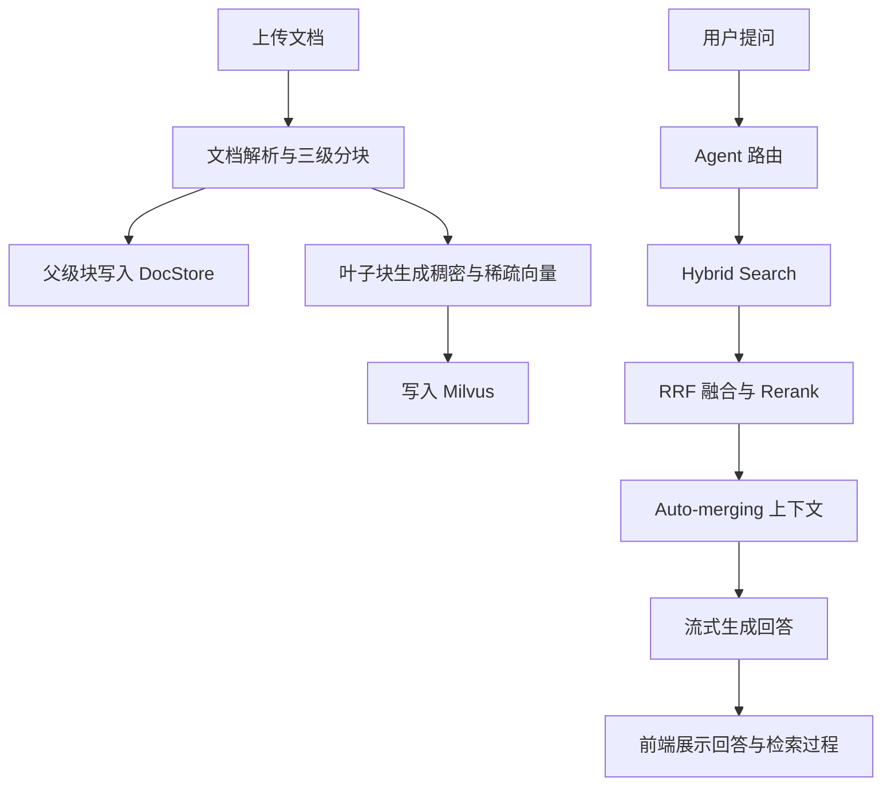

# 喵喵书房 · LangChain RAG

一个面向本地知识库问答的 RAG 应用。项目提供猫咪书房风格的聊天界面，支持文档入库、会话记忆、流式回答和检索过程展示。

## 功能一览

- 文档知识库：支持 PDF、Word 和 Excel 文档上传、切分与向量化。
- 智能问答：基于 LangChain Agent 调用知识库检索与天气查询工具。
- 混合检索：结合稠密向量、BM25 稀疏向量和 RRF 融合排序。
- 精排与降级：支持 Jina Rerank；未配置或调用失败时自动使用可用检索路径。
- 分层分块：文档以三级滑动窗口分块，叶子块写入 Milvus，父级块保存在本地 DocStore，并在检索时支持自动合并上下文。
- 流式体验：回答通过 SSE 逐段输出，检索、评分与重写步骤可实时显示。
- 会话管理：支持新建、查看、删除历史会话。
- 猫咪书房界面：提供书房主题聊天、快捷提问和“记忆书架”文档管理页面。

## 项目结构

```text
langchain-rag/
├── backend/                 # FastAPI、Agent、RAG 与 Milvus 逻辑
├── frontend/                # Vue CDN 单页前端
├── data/                    # 上传文件、会话与父级分块数据
├── docker-compose.yml       # Milvus、etcd、MinIO、Attu 服务
├── pyproject.toml           # 项目依赖与 Python 要求
├── requirements.txt         # pip 安装依赖清单
└── main.py                  # 项目入口
```

## 环境要求

- Python `3.12+`
- Docker Desktop 与 Docker Compose
- 可访问的大模型与嵌入模型服务
- 可选：Jina Rerank 服务、高德天气 API

## 快速开始

### 安装 Python 依赖

在项目根目录执行。推荐使用 `uv`：

```bash
uv sync
```

也可以使用 `pip`：

```bash
python -m venv .venv

# Windows PowerShell
.venv\Scripts\Activate.ps1

# macOS / Linux
source .venv/bin/activate

python -m pip install -U pip
python -m pip install -r requirements.txt
```

如需运行 `langchain-study/` 中的学习示例，可安装可选依赖：

```bash
python -m pip install -e ".[study]"
```

### 配置环境变量

在项目根目录创建 `.env` 文件：

```env
# ===== Model =====
ARK_API_KEY=your_ark_api_key
MODEL=your_model_name
BASE_URL=https://your-llm-endpoint/v1
EMBEDDER=your_embedding_model

# ===== Rerank（可选） =====
RERANK_MODEL=your_rerank_model
RERANK_BINDING_HOST=https://your-rerank-host
RERANK_API_KEY=your_rerank_api_key

# ===== Milvus =====
MILVUS_HOST=127.0.0.1
MILVUS_PORT=19530
MILVUS_COLLECTION=embeddings_collection

# ===== Auto-merging（可选） =====
AUTO_MERGE_ENABLED=true
AUTO_MERGE_THRESHOLD=2
LEAF_RETRIEVE_LEVEL=3

# ===== Weather tool（可选） =====
AMAP_WEATHER_API=https://restapi.amap.com/v3/weather/weatherInfo
AMAP_API_KEY=your_amap_api_key
```

### 启动 Milvus

确认 Docker Desktop 的状态为 `Engine running`，然后在项目根目录执行：

```bash
docker compose up -d
docker compose ps
```

首次拉取镜像时如遇网络中断，可以重试以下命令：

```bash
docker compose --parallel 1 pull
docker compose up -d
```

服务端口：

| 服务 | 地址或端口 |
| --- | --- |
| Milvus | `19530` |
| Milvus health | `9091` |
| MinIO API | `9000` |
| MinIO Console | `9001` |
| Attu | `8080` |

### 启动应用

```bash
# 使用 uv
uv run uvicorn backend.app:app --host 0.0.0.0 --port 8000 --reload

# 或使用已激活的虚拟环境
uvicorn backend.app:app --host 0.0.0.0 --port 8000 --reload
```

打开以下地址：

- 前端页面：`http://127.0.0.1:8000/`
- API 文档：`http://127.0.0.1:8000/docs`
- Attu 管理界面：`http://127.0.0.1:8080/`

## 使用说明

### 喵喵书房

- 在输入框中提问，按 Enter 发送，Shift + Enter 换行。
- 回答生成期间，发送按钮会变成停止按钮，可随时中止本次回答。
- 欢迎页提供知识库总结、FAQ 生成和资料整理等快捷入口。
- “我的书签”中可以查看或删除历史会话。

> 对话框中的回形针目前仅为界面元素；上传知识库文档请前往“记忆书架”。

### 记忆书架

1. 打开侧栏的“记忆书架”。
2. 选择 PDF、DOC、DOCX、XLS 或 XLSX 文件。
3. 点击“开始上传”，系统会完成解析、分块和向量入库。
4. 文档入库后，可在聊天中针对其内容提问。

## RAG 工作流



检索步骤如下：

1. 优先召回叶子层级文档块，执行稠密与稀疏混合检索。
2. 使用 RRF 融合排序；配置 Rerank 时对候选结果精排。
3. 对文档相关性进行评分；必要时通过 Step-Back 或 HyDE 重写查询并再次检索。
4. 根据命中的父子关系自动合并上下文，交由 Agent 生成最终回答。

## 核心模块

| 模块 | 说明 |
| --- | --- |
| `backend/app.py` | FastAPI 入口、静态资源挂载与 CORS 配置 |
| `backend/api.py` | 聊天、会话与文档管理接口 |
| `backend/agent.py` | LangChain Agent、流式响应与会话摘要 |
| `backend/rag_pipeline.py` | 检索、评分、重写工作流 |
| `backend/rag_utils.py` | 混合检索、Rerank 与查询扩展逻辑 |
| `backend/document_loader.py` | 文档加载与三级分块 |
| `backend/embedding.py` | 稠密向量调用与 BM25 稀疏向量生成 |
| `backend/milvus_client.py` | Milvus 集合与检索客户端 |
| `backend/parent_chunk_store.py` | 父级分块本地存储与回取 |
| `frontend/` | 猫咪书房单页前端 |

## API 概览

| 方法 | 路径 | 说明 |
| --- | --- | --- |
| `POST` | `/chat` | 非流式聊天 |
| `POST` | `/chat/stream` | SSE 流式聊天 |
| `GET` | `/sessions/{user_id}` | 获取会话列表 |
| `GET` | `/sessions/{user_id}/{session_id}` | 获取会话消息 |
| `DELETE` | `/sessions/{user_id}/{session_id}` | 删除会话 |
| `GET` | `/documents` | 获取已入库文档 |
| `POST` | `/documents/upload` | 上传并向量化文档 |
| `DELETE` | `/documents/{filename}` | 删除文档及对应向量 |

## 技术栈

- 后端：FastAPI、Uvicorn、Pydantic、LangChain、LangGraph。
- 检索：Milvus、BM25、RRF、Jina Rerank。
- 前端：Vue CDN、marked、highlight.js、原生 CSS。
- 基础服务：Docker Compose、etcd、MinIO、Attu。

